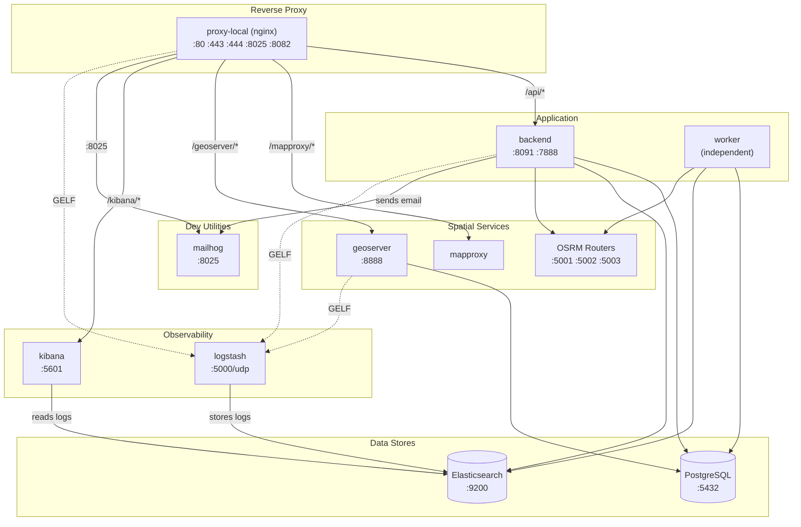

# LIPAS Development Guide

## Architecture Overview

LIPAS runs as a containerized stack orchestrated by Docker Compose. The architecture follows a reverse-proxy pattern with specialized services.



### Container Roles

**Proxy Layer**
- `proxy-local` — Nginx reverse proxy for local development. Routes traffic to backend services and serves static files.

**Application**
- `backend` — Clojure web server (Jetty). Runs on host machine during development, in container for staging/production.
- `worker` — Background job processor. Not linked to proxy, runs independently for async tasks (PTV sync, analytics, etc.).

**Data Stores**
- `postgres` — PostgreSQL with PostGIS extension. Primary database.
- `elasticsearch` — Search index for sports facilities and analytics.

**Spatial Services**
- `mapproxy` — Caching tile proxy for background maps.
- `geoserver` — WFS/WMS services for GIS data access.
- `osrm-*` — Routing engines for car, bicycle, and foot travel distance calculations.

**Observability**
- `logstash` — Log aggregation (GELF input).
- `kibana` — Log visualization and dashboards.

**Development Utilities**
- `mailhog` — SMTP testing (captures emails at localhost:8025).
- `memgraph` — Optional graph database for code analysis.


## Prerequisites

- Docker and Docker Compose
- Java 21+ (Temurin recommended)
- Clojure CLI tools (`clj`)
- Node.js 16+ (for ClojureScript build)


## Local Development Setup

### 1. Environment Configuration

```bash
# Copy sample environment file
cp .env.sample.sh .env.sh

# Edit with your configuration
# Required: DB_PASSWORD, DB_SUPERUSER_PASSWORD, ADMIN_PASSWORD
# Optional services can use placeholder values initially
vim .env.sh

# Load environment (do this in each terminal session)
source .env.sh
```

### 2. Database Setup

You need either a production database dump or generated sample data.

**Option A: Import from production dump**
```bash
# Restore a pg_dump backup (coordinate with team for dump file)
docker compose up -d postgres
docker compose exec postgres pg_restore -U postgres -d lipas /path/to/dump.sql
```

**Option B: Generate sample data**
```bash
docker compose up -d postgres
docker compose run --rm backend-seed
```

### 3. Generate SSL Certificate

The proxy requires SSL certificates in `certs/server.key` and `certs/server.crt`.

For local development, generate a self-signed cert — see [certs/README.md](certs/README.md) for the one-liner.

### 4. Start Infrastructure Containers

```bash
# Start proxy and linked services (postgres, elasticsearch, mapproxy, etc.)
docker compose up -d proxy-local

# Verify containers are running
docker compose ps
```

The proxy listens on:
- `:80/:443` — Main web app
- `:8025` — MailHog web UI
- `:8082` — Legacy API test endpoint

### 5. OSRM Routing Data (Optional)

Routing features require OSRM data (~1GB download). See [osrm/README.md](osrm/README.md) for setup.

### 6. Start Development Environment

Shadow-cljs handles both ClojureScript compilation and the backend nREPL.

```bash
cd webapp

# Install Node dependencies (first time only)
npm install

# Start shadow-cljs - compiles ClojureScript and starts nREPL on port 7888
npx shadow-cljs watch app
```

### 7. Connect to REPL

Connect your editor to the nREPL at **port 7888**, then:

```clojure
;; Start the system (Jetty server, DB connections, etc.)
(user/reset)

;; First time only: run database migrations
(user/run-db-migrations!)

;; Set a password for the admin user
(user/reset-admin-password! "your-dev-password")

;; To switch to ClojureScript REPL (for frontend debugging)
(user/browser-repl)

;; To return to Clojure REPL
:cljs/quit
```

Access the app at `https://localhost` (uses self-signed cert).


## Development Workflow

### Daily Startup

```bash
# Terminal 1: Load env and start containers
source .env.sh
docker compose up -d proxy-local

# Terminal 2: Start shadow-cljs (provides both CLJS compilation and nREPL)
cd webapp && npx shadow-cljs watch app

# Editor: Connect to nREPL at port 7888, then run (user/reset)
```

### Code Changes

- **Clojure backend**: Eval changed forms in REPL, or `(user/reset)` to reload all namespaces
- **ClojureScript frontend**: Hot-reloaded automatically by shadow-cljs
- **Database schema**: Add migration in `resources/migrations/`, then `(user/run-db-migrations!)`

### Useful REPL Functions

See `webapp/dev/user.clj` for all available utilities:

```clojure
(user/reset)                    ; Reload code and restart system
(user/db)                       ; Get database connection
(user/search)                   ; Get Elasticsearch client
(user/reindex-search!)          ; Rebuild search index
(user/reset-admin-password! "x"); Set admin password
(user/run-db-migrations!)       ; Apply pending migrations
(user/browser-repl)             ; Switch to ClojureScript REPL
(user/compile-cljs)             ; Compile ClojureScript (check for errors)
```


## Running Tests

```clojure
;; In REPL, after (user/reset)

;; Run a single test
(require 'lipas.backend.core-test :reload)
(clojure.test/run-tests 'lipas.backend.core-test)

;; Run single test var
(clojure.test/run-test lipas.backend.core-test/some-test)
```

Or via Babashka:

```bash
cd webapp

# Run tests in a namespace
bb test-ns lipas.backend.core-test

# Run a specific test var
bb test-var lipas.backend.core-test/some-test
```


## Container Reference

| Service       | Purpose              | Local Port          |
|---------------|----------------------|---------------------|
| proxy-local   | Nginx reverse proxy  | 80, 443, 8025, 8082 |
| postgres      | PostgreSQL + PostGIS | 5432                |
| elasticsearch | Search index         | 9200                |
| mapproxy      | Tile caching proxy   | (via nginx)         |
| geoserver     | WFS/WMS services     | 8888                |
| kibana        | Log visualization    | 5601 (via nginx)    |
| mailhog       | SMTP testing         | 8025                |
| osrm-car      | Car routing          | 5001                |
| osrm-bicycle  | Bicycle routing      | 5002                |
| osrm-foot     | Foot routing         | 5003                |


## Troubleshooting

**Container won't start**
```bash
docker compose logs <service-name>
```

**Backend can't connect to database**
- Verify `source .env.sh` was run in your terminal
- Check postgres container is running: `docker compose ps postgres`

**Search not working**
- Verify elasticsearch is running: `curl localhost:9200`
- Rebuild index: `(user/reindex-search!)` in REPL

**ClojureScript changes not appearing**
- Check shadow-cljs console for compilation errors
- Hard refresh browser (Cmd+Shift+R)

**REPL won't connect**
- Ensure `npx shadow-cljs watch app` is running
- nREPL port is 7888


## Additional Resources

- [webapp/CLAUDE.md](webapp/CLAUDE.md) — Detailed development guide (REPL usage, testing patterns)
- [webapp/dev/user.clj](webapp/dev/user.clj) — All REPL utility functions
- [docs/](docs/) — API documentation
