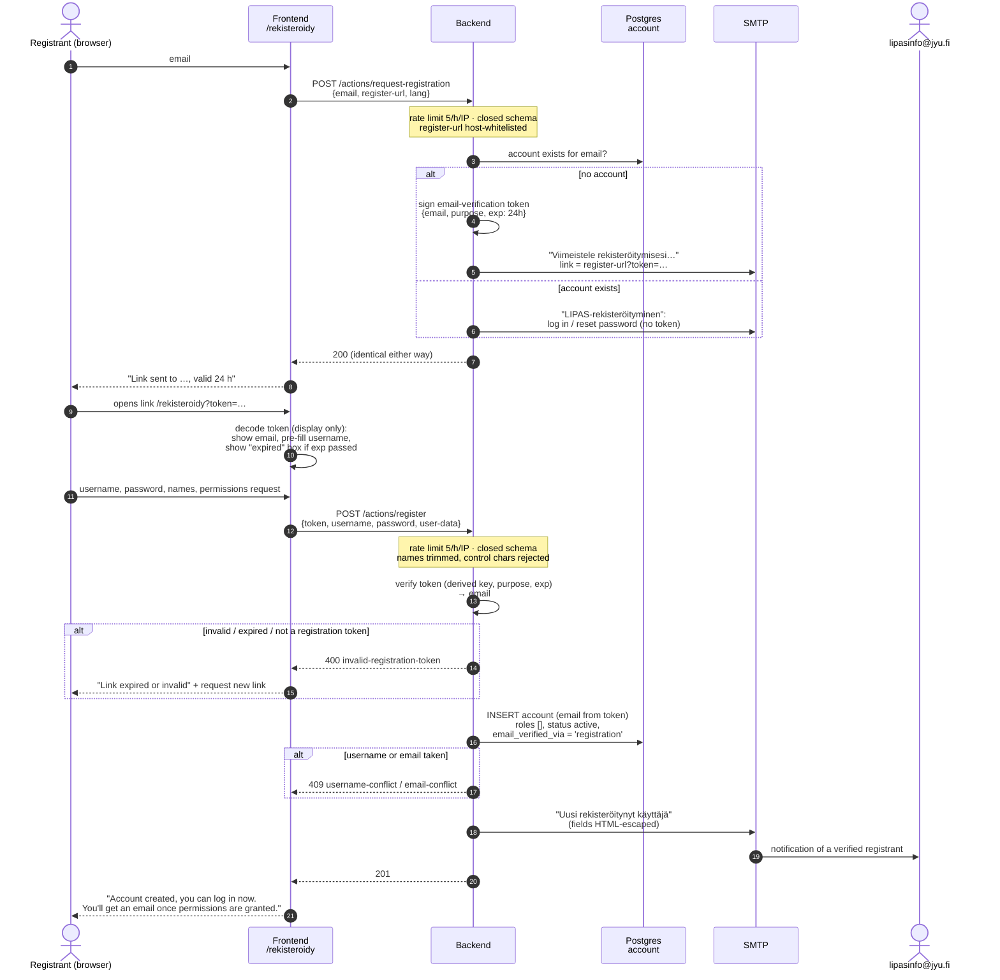
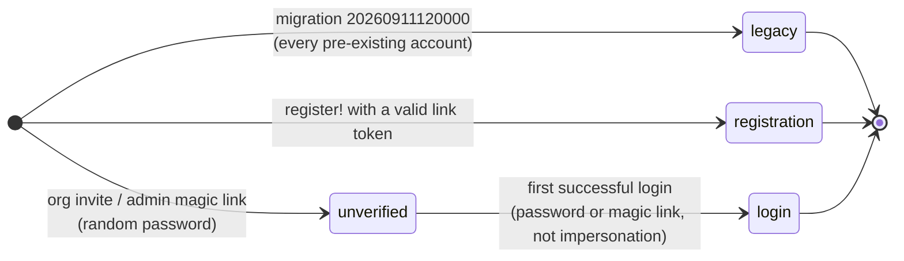

# User registration, email verification and permission granting

How a person gets from "no account" to "can edit sports sites" in LIPAS.

- **Self-registration is email-first.** The user enters an address, gets a
  link, and completes the registration on the page the link opens. No account
  row exists until then, so a mistyped address leaves nothing behind.
- **A new account has no roles.** A LIPAS admin grants them by hand, which
  sends the "Käyttöoikeutesi on päivitetty" email with a 7-day login link.
- **Every account records how its email address was proven**
  (`account.email_verified_via`). Accounts that predate verification are
  marked `legacy`, meaning implicitly trusted.

Before September 2026 the address was never verified. The registrant chose a
password for any address they liked, and an org invite for that address would
attach to their account. See [History](#history-the-unverified-flow).

## 1. Self-registration

Code: `lipas.ui.register.*` → `POST /actions/request-registration` and
`POST /actions/register` (`handler.clj`) → `core/request-registration!`,
`core/register!`.



Design notes:

- **The link token is stateless.** It's a JWT carrying `email`,
  `purpose: "email-verification"` and a 24-hour `exp`. It is signed with a key
  *derived* from `:auth-key`, never with the key itself (`lipas.backend.jwt`).
  The login backend accepts any `:auth-key`-signed JWT as an identity, so the
  separate key is what stops a registration link from working as a login
  token. It also stops a login token from registering. Both directions are
  tested.
- **The email comes only from the token.** `/actions/register` has no email
  field, and the handler reads the coerced `:parameters`. Extra keys such as
  `permissions`, `status` or `email_verified_via` are dropped before the
  handler runs.
- **The same link can't make two accounts.** A second submit hits the
  unique-email check and returns 409. No token store is needed.
- **The request endpoint is not an account-existence oracle.** It always
  answers 200. The address owner gets whichever mail applies, and the address
  is kept out of the log, as with password reset.

## 2. Admin grants permissions (unchanged)

Code: `lipas.ui.admin.events/::save-user` → `POST /actions/update-user-permissions`
(`:require-privilege :users/manage`) → `core/update-user-permissions!`

```mermaid
sequenceDiagram
    autonumber
    actor A as LIPAS admin
    participant FE as Admin UI<br/>/admin
    participant BE as Backend
    participant DB as Postgres<br/>account
    participant SMTP as SMTP
    actor U as Account owner

    Note over A: Reads the lipasinfo notification;<br/>the users table shows "Email verified"
    A->>FE: pick roles (city-manager, type-manager, …)
    FE->>BE: POST /actions/update-user-permissions<br/>{id, permissions, login-url}
    BE->>DB: UPDATE permissions
    BE->>DB: revoke existing tokens (tokens_valid_from = now)
    BE->>SMTP: "Käyttöoikeutesi on päivitetty"<br/>+ 7-day magic login link
    SMTP->>U: email
    BE->>DB: history event "permissions-updated"
    BE-->>FE: 200
```

The email goes out on every permission change, including removals.

## 3. Email verification on the account

Verification is a property of the row, not a lifecycle state. `status`
(`active`/`archived`) is separate from it. Self-registration never creates an
unverified row, so there's no "pending account" to expire or clean up.



| `email_verified_via` | Meaning | `email_verified_at` |
|---|---|---|
| `legacy` | Account predates verification. Trusted implicitly. | NULL (unknown) |
| `registration` | Opened the emailed link before the account existed. | when registered |
| `login` | Created *for* the address (org invite, admin magic link) and later logged in. | first login |
| NULL | Invite/admin-created, never logged in. | NULL |

Why a first login proves the address: after the migration, every unverified
account was created with a random password nobody knows. The admin
`send-magic-link` endpoint strips any client-supplied password to keep it that
way. The only ways in are the emailed link or a password reset, and both go
through the inbox. `core/mark-email-verified-by-login!` runs on password login
and on `refresh-login`, which is where magic links land. It skips impersonation
sessions, because that login is the admin's, not the owner's. The first proof
wins, and later logins don't change it.

The admin users table shows this as the "Sähköposti vahvistettu" column.

## 4. Input validation and sanitization

| Where | What |
|---|---|
| `/actions/request-registration` | Closed schema: `email` (email regex), `register-url` (https, LIPAS host whitelist), optional `lang` ∈ fi/se/en |
| `/actions/register` | Closed schema (`users/registration-payload-schema`). Self-chosen usernames are limited to the email local-part characters: no whitespace, no `:` (the Basic-auth separator), no `@`. Password 6–128 characters. |
| Names, permissions request (`users/human-text`) | Trimmed on JSON decode. Blank and control characters rejected; the permissions request may contain line breaks. Also applies to `/actions/update-user-data`. |
| `/actions/send-feedback` | Handler reads the coerced body, not the raw one. |
| HTML email bodies | `email/escape-html` (now also escapes quotes) applied to every value: registration and ops mails, feedback, reminder messages, org names, and links. Plain-text parts are left as typed. |

## History: the unverified flow

Until September 2026, `/actions/register` took `{email, username, password,
user-data}` straight from the request body, only removing `:permissions`, with
no server-side schema. It created an active account with the chosen password
and mailed a `pprint` of the body, unescaped, to lipasinfo. The registrant got
no email. The first mail to the address was the permissions-updated one, sent
after the roles were already granted, and the self-chosen password kept
working whoever read that mail. That enabled the following:

1. **Impersonation for edit rights.** Someone could register a municipal
   address and request that city. An admin who trusted the address would grant
   the roles to whoever had filled in the form.
2. **Org invites attaching to a squatted account.** `invite-org-member!` adds
   an existing account for the invited address as it is. The invite form's
   "already registered" hint made that look reassuring.
3. **Blocking the real owner.** A squatted address stopped its real owner from
   registering, until they used password reset.
