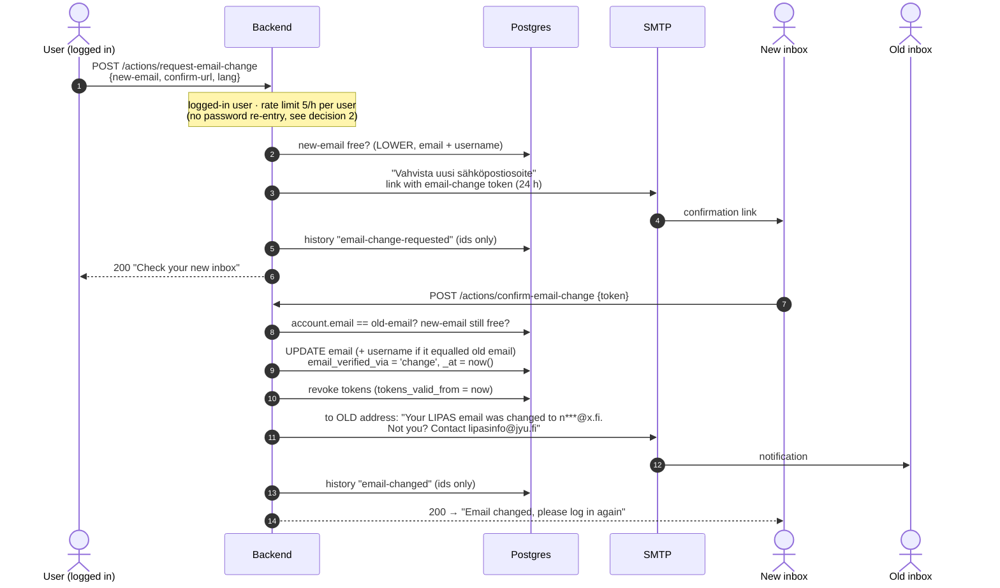

# Changing an account's email address: investigation

Status: **implemented** on `feat/email-verification` (PR #240), following the
decisions at the end of this document. It builds on the email verification in
the same PR (`account.email_verified_via`, purpose-scoped tokens in
`lipas.backend.jwt`). The rest of this document is the investigation that led
there.

Request: a LIPAS admin can change any user's email, and a user can change
their own.

## TL;DR

Today nobody can change an email through the UI. The admin dialog and the
profile both show the field disabled. The only code path that rewrites an
email is GDPR removal.

The email is more than contact data. In LIPAS it is:

1. **A login identifier.** `core/get-user` looks the login name up as email
   first, then as username.
2. **The only reachable credential.** Magic links, password reset, invites and
   permission-update links are all "proof via inbox". Whoever controls the
   stored address controls the account.
3. **Often also the username.** 577 of 2,343 accounts (25 %, dev snapshot)
   have `username = email`: org-invite and admin-created accounts.

So an email change is a credential change. Recommendation: **every change,
self-service or admin, becomes effective only when a link sent to the new
address is opened.** The old address gets a notification, and all existing
sessions and links are revoked. This reuses the PR #240 machinery: a stateless
purpose-scoped token and `revocation/revoke!`.

## What changing `account.email` touches

| Touchpoint | Where | Effect of a change | Needed |
|---|---|---|---|
| Login by email | `core/get-user` (email → username → id) | New address works immediately | none |
| Login by old address | Same: if `username` = old email, the old address still logs in as a username | Old address keeps working as a login name | Move the username along when it equals the old email |
| JWT payload | `jwt/create-token` embeds `:email :username` | Existing tokens carry the old address for up to 6 h | `revocation/revoke!` (GDPR removal already does this) |
| Outstanding links to the old inbox | Magic link / permissions-updated / invite: 7 days; reset: 24 h | Whoever reads the old inbox can still log in | The same `revoke!` kills them |
| Uniqueness | `UNIQUE(email)`, `UNIQUE(username)`, case-sensitive; lookups use `LOWER()` | A case variant of an existing address could slip in | Check with `LOWER()` in code; see open question 4 (1 case-duplicate already exists) |
| Org invites | `invite-org-member!` looks up by email; a new account gets `username = email` | Inviting a user's old address: if the username still equals it, `add-user!` fails with `username-conflict` | Moving the username along fixes it |
| Org members, site editors, edit history | `org/members`, `resolve-account-names` read `account` live by id | Show the new address automatically | none |
| Reminders | `lipas.reminders/->email` reads the address at send time | Go to the new address | none |
| Frontend session | `login-data` in localStorage includes `:email` | Stale until refresh | Revocation logs the session out; the confirm page asks to log in again |
| Jobs `created-by`, log lines | `core/enqueue-sports-site-jobs!`, save logs | Historical rows keep the old address | Accept. Better: log the user id, not the email (small hardening) |
| Analytics ES index | `search-indexer/enrich-for-analytics` stores `author {id email …}` | Old address stays in analytics docs until reindex | Accept, or reindex periodically. Key by id |
| Accessibility register | `accessibility/make-params` sends `"user" (:email user)` to the external register | If the register keys a user's contributions by email, the history splits | **Ask the register's operator** |
| AI assistant support mail | `assistant.clj` quotes `(:email user)` | Uses the current address | none |
| Mailchimp newsletter | Separate subscribe form, not tied to the account | Unaffected; the user resubscribes if they want | none |
| `account.history` | Audit events | Should record the change | Store ids only, not addresses (see GDPR below) |
| `email_verified_via` | PR #240 | The new address must be proven, too | Set `'change'`, or reuse `'registration'`; see open question 1 |

## Risks a naive "just update the column" would create

1. **An admin typo hands the account to a stranger.** The next magic link,
   reset link or permissions mail goes to the typo'd inbox, and that is a
   full login.
2. **A stolen session becomes a permanent takeover.** A 6-hour token is
   enough to point the account at the attacker's inbox, and password reset
   does the rest.
3. **The old inbox keeps access.** Outstanding 7-day links still work. The old
   address also still logs in when it is the username.
4. **It reopens the problem PR #240 closed.** An unverified address on an
   account with a known password breaks the invariant behind
   `mark-email-verified-by-login!`, which assumes an unverified account can
   only be entered through its inbox.

## Proposed flow

One token type, `purpose: "email-change"`, signed with its own derived key
like the registration token. Claims: `{account-id, old-email, new-email, exp:
24h}`. The token itself is the pending state, so there is no new table.
Confirming checks that:

- the account still exists and is active,
- its **current** email still equals `old-email`. A confirmed change or a
  later request makes older links dead automatically, with no nonce storage,
- `new-email` is not taken, compared with `LOWER()`, against both `email` and
  `username`.

### Self-service (profile page)

### Admin (user-management dialog)

The same confirmation, started by an admin:
`POST /actions/request-email-change-for-user {id, new-email, confirm-url}`,
behind `:require-privilege :users/manage`. It needs no password. The history
records the admin's id. The confirmation mail says "a LIPAS administrator
changed the address…".

The admin dialog shows "change pending" only if we decide to track it. The
stateless token has no DB record, so either accept "no pending indicator" or
add a small `email_change_requested_at` column for display only. Tokens are
validated statelessly either way.

Deliberately not in v1: an admin "force change without confirmation". If it
is needed for mailbox-gone cases, it should require a follow-up password reset
from the new address, and it should set a distinct
`email_verified_via = 'admin'` so the "first login proves the inbox" invariant
is not silently broken. In practice the new-inbox link covers these cases: the
person does have the new mailbox.

## GDPR / data notes

- **Audit:** record `email-change-requested` and `email-changed` with actor
  and target ids, not addresses. Precedent: migration
  `20260802130000-scrub-impersonation-emails-from-history` removed emails from
  `history` because GDPR removal doesn't clear history. The old-address
  notification mail is the user-facing record.
- **Masking:** mask the new address in the mail to the old inbox
  (`n***@x.fi`), so a mailbox that has passed to someone else doesn't learn it.

## Estimate of work

- **Backend:** token functions in `jwt`, `core/request-email-change!` and
  `core/confirm-email-change!` (transaction: email, optional username,
  verification fields, revoke, history), 3 routes plus route-auth and
  rate-limit test updates, 2 email copies in fi/se/en. Migration: the
  `email_verified_via` enum gains `'change'`.
- **Frontend:** a "Change email" dialog on the profile, a confirm route
  (`/vahvista-sahkoposti?token=`), and a "Change email" action in the admin
  user dialog.
- **Tests:** mirror `registration-test`:
  - token forgery, expiry and cross-purpose use
  - a stale link after a second change
  - collision with `LOWER()`
  - the username moving along only when it equals the old email
  - revocation and old-address notification
  - admin gate and self-service password check
- **Size:** roughly the size of PR #240.

## Decisions (2026-09-11)

1. **Verification label:** a separate `change` value, meaning "proven at the
   last change". Migration `20260911130000` adds it to the CHECK constraint.
2. **No password re-entry** for self-service. The new-inbox confirmation, the
   old-inbox notification and revoking every session are the safeguards.
   Requests are limited to 5 per hour per user.
3. **Accessibility register:** not in use, so it's ignored for now.
4. **Case-insensitive uniqueness:** yes. The migration replaces
   `UNIQUE(email)` with a unique index on `lower(email)`. It first resolves
   existing case-duplicates: per address, it keeps the account with the latest
   recorded login (fallback: most recently created) and archives the others
   behind a `case_duplicate_<id>@lipas.fi` placeholder, with sessions revoked
   and an audit event. On the dev snapshot this archived one of the one pair.
   `username` uniqueness was left as it is (0 case-duplicates today).
5. **Bulk domain changes:** out of scope.

As built:

- **Endpoints:**
  - `POST /actions/request-email-change`: any logged-in user, 5 per hour.
  - `POST /actions/request-email-change-for-user`: `:users/manage`.
  - `POST /actions/confirm-email-change`: public; the token is the credential.
- **Self-service with a taken address:** the response is the same 200, and
  the address's owner gets a "this address already has an account" note. The
  admin endpoint returns 409 instead.
- **Frontend:**
  - "Vaihda sähköpostiosoite" on the profile page and in the admin user
    dialog, sharing one dialog, `lipas.ui.components.email-change`.
  - The link opens `/vahvista-sahkoposti`.
- **Tests:** `lipas.backend.email-change-test`.
